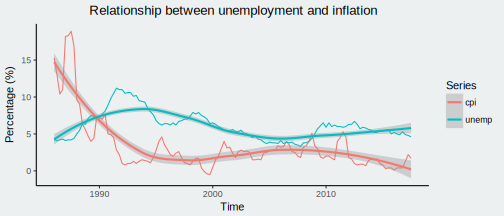

Can we forecast unemployment for the December quarter using inflation which is released a month earlier ?
The full details of this post will be released soon on my projects page and will include more thorough testing. Here we will do some basic [ARIMA]() modelling to forecast the unemployment release in two days time.

### Background

I was interested in messing with time series data. Initially I was looking at the inverse relationship between unemployment and inflation (CPI). The general thought is that lower unemployment means higher wages i.e. buying power and thus an increase in inflation. However, I figured if the two are correlated then perhaps we could use the CPI as a predictor of unemployment. The timing was quite coincidental in that the next labour market release is three days from now. Lets see what estimates we can get and how close we end up to Wednesday's release.

### The details

We can see in the graph below that there is a reasonably strong relationship between unemployment and inflation. My main concern though, is that the trend is very long term. This means inflation may be pretty pathetic at predicting short-term trends for unemployment. The full report will test this out more carefully, in this post I'll report a couple of forecasts and we can see how well they stack up.

The industry standard for forecasting is the [ARIMA](https://en.wikipedia.org/wiki/Autoregressive_integrated_moving_average) model, used extensively for timeseries forecasting. Luckily its prevelance means a lot of effort has gone into making functions that work great out of the box (admittedly I did a small amount of tuning though). Using the `forecast::auto.arima()` function, a pure timeseries forecast would suggest a seasonally adjusted unemployment of **4.45%** for 2017 Q4. When we include the inflation for Q4, released a month before the unemployment rate, we get an adjusted rate of **4.49%**.

### Conclusion

Interestingly both forecasts were projecting a decrease of 0.1p.p. from the current 4.6%. However most of the banks are bracing for an increase in unemployment (e.g. [ASB economic weekly](https://www.asb.co.nz/content/dam/asb/documents/reports/economic-weekly/economicweekly_050218.pdf)). So it will be fun to see how my bumpkin ARIMA model with open data stacks up on Wednesday !

I had played around with a few other models, all rounding out to **4.5%** but with large error (+/- 0.6p.p). However, I think there would be huge scope to using more detailed covariates for this type of modelling. Some ideas would be webscraped information on job searches or the number of people on jobseeker benefits. You could also consider modelling under-employment, perhaps a surge in those seeking more hours can be seen before lay-offs are made. Hinting towards an increase in unemployment on the horizon.

In either case, do look out for my full report and code to be made available on GitHub. It should be an interesting intro to dabbling with forecasting and seasonal adjustment.